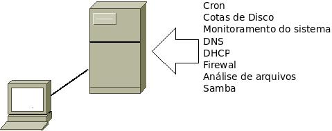
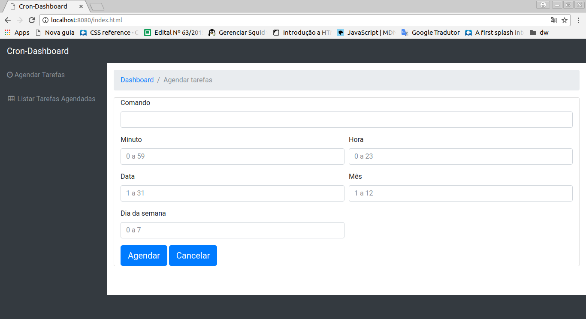
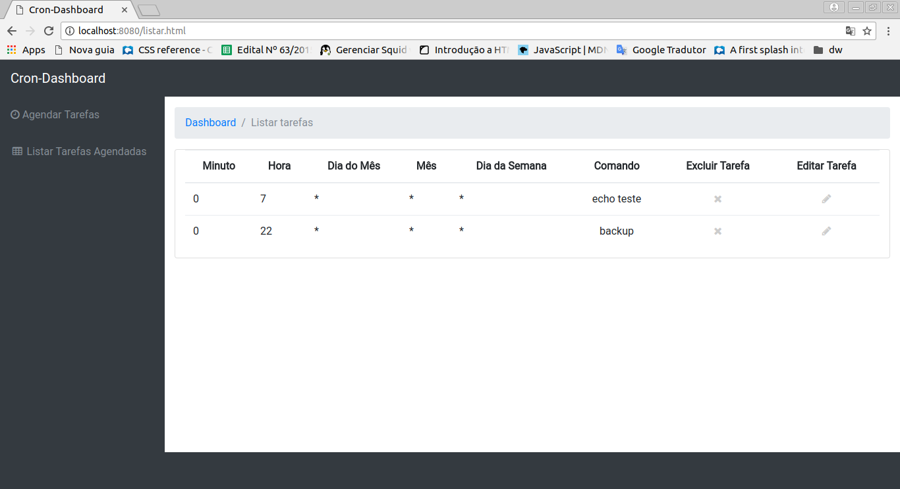

# CronDashboard

Projeto de desenvolvimento de uma interface simples para o gerenciamento de tarefas a serem executadas pelo serviço Cron.

## Aplicabilidade

Esta aplicação é útil para servidores que necessitam realizar repetidamente a mesma tarefa.



## API Doc

- [Adiconar Tarefa](#adiconar-tarefa)
- [Listar Tarefa ](#listar-tarefa)
- [Remover Tarefa](#remover-tarefa)

### Pré-requisitos

-Sistema Operacional Linux
+Apache
+PHP

### Adiconar Tarefa

Esse serviço tem a finalidade de adicionar tarefas a serem executadas pelo Cron

```
GET /api/add-task.php?minute=minuto&hour=hora&day=dia&month=mes&weekDay=diaSemana&task=comand
```

Parâmetros

| Name | Tipo | Descrição |
|-|-|-|
| Minuto | String | entre 0 a 59 minutos; * para todos os minutos |
| Hora | String | 0 a 23 horas; * para todas as horas|
| Dia do mês | String | 0 a 31; * para todos os dias|
| Mês | String |  0 a 12; * para todos os meses |
| Dia da semana | String | 0 a 6 (0 ou 7 equivalem ao domingo); |
| Comando | String | script ou comando a ser executado |

Exemplo

```
/api/add-task.php?minute=00&hour=23&day=31&month=12&weekDay=7&task=echo+hello
```

Em caso de sucesso:

```js
{
  "status": "Tarefa agendada com sucesso."
}
```

Em caso de erro:

```js
{
  "status": "Tarefa não agendada"
}
```

Para executar tal ação é necessário executar o comando:

```
$ crontab <<EOF
    00 09 * * 1-5 echo hello
  EOF"
```

Para validar a adição da nova tarefa, liste as tarefas alocadas e verifique se a nova tarefa foi incluida.

### Listar Tarefas

Este serviço listará todas as tarefas agendadas inseridas no arquivo crontab de acordo.


Exemplo

```
GET /api/show-taks.php
```

Em caso de sucesso:

```js

"cron" :
      [
          { "0" : [
                  "minute" :	"00"
                  "hour" :	"23"
                  "day" :	"31"
                  "month" :	"12"
                  "weekDay" :	"7"
                  "task" :	"echo hello"
                  ]
          }
      ]
```

Em caso de erro:

```js
{
  "erro": "Problema ao listar as tarefas."
}
```

Para executar tal ação é necessário executar o comando:

```
$ crontab -l
```

### Remover Tarefas

Este serviço tem a finalidade de remover uma tarefa agendada na lista do crontab.

Exemplo

```
GET /api/rm-task.php?remove=1
```

### Screenshots

Tela inicial para agendamento



Tela de exibição das tarefas agendadas


